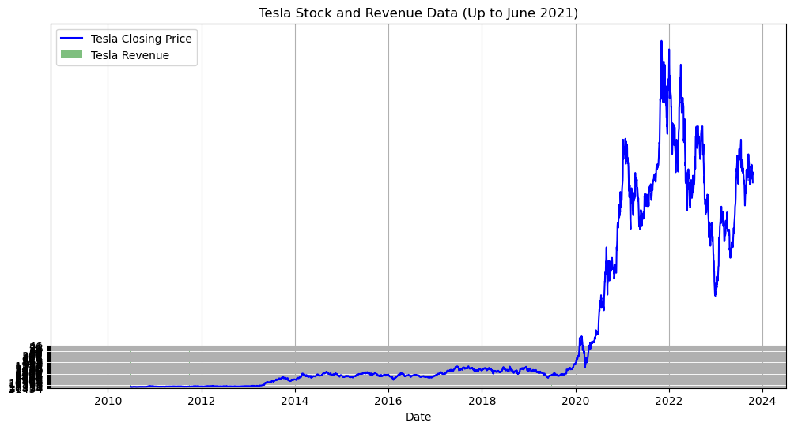
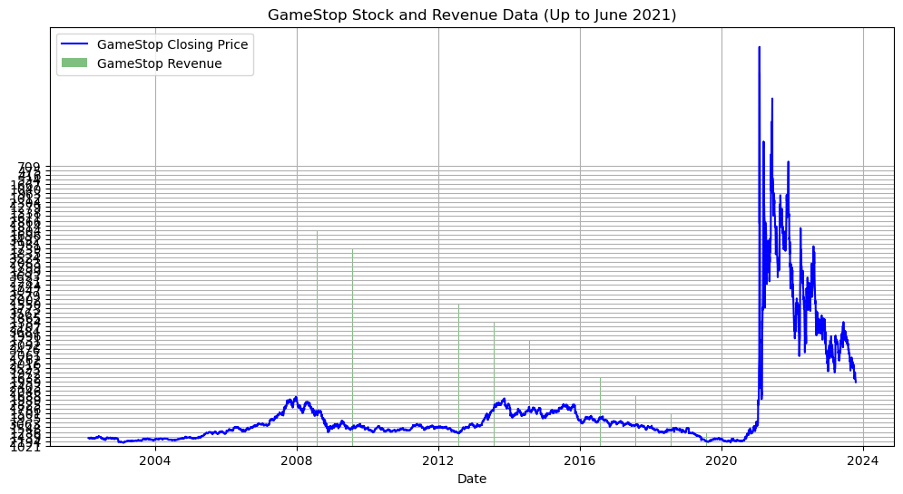

<p style="text-align:center">
    <a href="https://skills.network/?utm_medium=Exinfluencer&utm_source=Exinfluencer&utm_content=000026UJ&utm_term=10006555&utm_id=NA-SkillsNetwork-Channel-SkillsNetworkCoursesIBMDeveloperSkillsNetworkPY0220ENSkillsNetwork900-2022-01-01" target="_blank">
    
    </a>
</p>


<h1>Extracting and Visualizing Stock Data</h1>
<h2>Description</h2>


Extracting essential data from a dataset and displaying it is a necessary part of data science; therefore individuals can make correct decisions based on the data. In this assignment, you will extract some stock data, you will then display this data in a graph.


<h2>Table of Contents</h2>
<div class="alert alert-block alert-info" style="margin-top: 20px">
    <ul>
        <li>Define a Function that Makes a Graph</li>
        <li>Question 1: Use yfinance to Extract Stock Data</li>
        <li>Question 2: Use Webscraping to Extract Tesla Revenue Data</li>
        <li>Question 3: Use yfinance to Extract Stock Data</li>
        <li>Question 4: Use Webscraping to Extract GME Revenue Data</li>
        <li>Question 5: Plot Tesla Stock Graph</li>
        <li>Question 6: Plot GameStop Stock Graph</li>
    </ul>
<p>
    Estimated Time Needed: <strong>30 min</strong></p>
</div>

<hr>


***Note***:- If you are working in IBM Cloud Watson Studio, please replace the command for installing nbformat from `!pip install nbformat==4.2.0` to simply `!pip install nbformat`


```python
!pip install yfinance==0.1.67
!mamba install bs4==4.10.0 -y
!pip install nbformat==4.2.0
```

    Collecting yfinance==0.1.67
      Downloading yfinance-0.1.67-py2.py3-none-any.whl (25 kB)
    Requirement already satisfied: pandas>=0.24 in /home/jupyterlab/conda/envs/python/lib/python3.7/site-packages (from yfinance==0.1.67) (1.3.5)
    Requirement already satisfied: numpy>=1.15 in /home/jupyterlab/conda/envs/python/lib/python3.7/site-packages (from yfinance==0.1.67) (1.21.6)
    Requirement already satisfied: requests>=2.20 in /home/jupyterlab/conda/envs/python/lib/python3.7/site-packages (from yfinance==0.1.67) (2.31.0)
    Requirement already satisfied: multitasking>=0.0.7 in /home/jupyterlab/conda/envs/python/lib/python3.7/site-packages (from yfinance==0.1.67) (0.0.11)
    Requirement already satisfied: lxml>=4.5.1 in /home/jupyterlab/conda/envs/python/lib/python3.7/site-packages (from yfinance==0.1.67) (4.9.2)
    Requirement already satisfied: python-dateutil>=2.7.3 in /home/jupyterlab/conda/envs/python/lib/python3.7/site-packages (from pandas>=0.24->yfinance==0.1.67) (2.8.2)
    Requirement already satisfied: pytz>=2017.3 in /home/jupyterlab/conda/envs/python/lib/python3.7/site-packages (from pandas>=0.24->yfinance==0.1.67) (2023.3)
    Requirement already satisfied: charset-normalizer<4,>=2 in /home/jupyterlab/conda/envs/python/lib/python3.7/site-packages (from requests>=2.20->yfinance==0.1.67) (3.1.0)
    Requirement already satisfied: idna<4,>=2.5 in /home/jupyterlab/conda/envs/python/lib/python3.7/site-packages (from requests>=2.20->yfinance==0.1.67) (3.4)
    Requirement already satisfied: urllib3<3,>=1.21.1 in /home/jupyterlab/conda/envs/python/lib/python3.7/site-packages (from requests>=2.20->yfinance==0.1.67) (1.26.15)
    Requirement already satisfied: certifi>=2017.4.17 in /home/jupyterlab/conda/envs/python/lib/python3.7/site-packages (from requests>=2.20->yfinance==0.1.67) (2023.5.7)
    Requirement already satisfied: six>=1.5 in /home/jupyterlab/conda/envs/python/lib/python3.7/site-packages (from python-dateutil>=2.7.3->pandas>=0.24->yfinance==0.1.67) (1.16.0)
    Installing collected packages: yfinance
      Attempting uninstall: yfinance
        Found existing installation: yfinance 0.2.31
        Uninstalling yfinance-0.2.31:
          Successfully uninstalled yfinance-0.2.31
    Successfully installed yfinance-0.1.67
    
                      __    __    __    __
                     /  \  /  \  /  \  /  \
                    /    \/    \/    \/    \
    ███████████████/  /██/  /██/  /██/  /████████████████████████
                  /  / \   / \   / \   / \  \____
                 /  /   \_/   \_/   \_/   \    o \__,
                / _/                       \_____/  `
                |/
            ███╗   ███╗ █████╗ ███╗   ███╗██████╗  █████╗
            ████╗ ████║██╔══██╗████╗ ████║██╔══██╗██╔══██╗
            ██╔████╔██║███████║██╔████╔██║██████╔╝███████║
            ██║╚██╔╝██║██╔══██║██║╚██╔╝██║██╔══██╗██╔══██║
            ██║ ╚═╝ ██║██║  ██║██║ ╚═╝ ██║██████╔╝██║  ██║
            ╚═╝     ╚═╝╚═╝  ╚═╝╚═╝     ╚═╝╚═════╝ ╚═╝  ╚═╝
    
            mamba (1.4.2) supported by @QuantStack
    
            GitHub:  https://github.com/mamba-org/mamba
            Twitter: https://twitter.com/QuantStack
    
    █████████████████████████████████████████████████████████████
    
    
    Looking for: ['bs4==4.10.0']
    
    [?25l[+] 0.0s
    [+] 0.1s
    pkgs/main/linux-64 ━━━╸━━━━━━━━━━━━━━━╸━━━━━   0.0 B /  ??.?MB @  ??.?MB/s  0.1s
    pkgs/main/noarch   ━━━━━━━╸━━━━━━━━━━━━━━━╸━   0.0 B /  ??.?MB @  ??.?MB/s  0.1s
    pkgs/r/linux-64    ━━━━━━╸━━━━━━━━━━━━━━━╸━━   0.0 B /  ??.?MB @  ??.?MB/s  0.1s
    pkgs/r/noarch      ━╸━━━━━━━━━━━━━━━╸━━━━━━━   0.0 B /  ??.?MB @  ??.?MB/s  0.1s[+] 0.2s
    pkgs/main/linux-64 ━━━━━╸━━━━━━━━━━━━━━━╸━━━  45.1kB /  ??.?MB @ 294.2kB/s  0.2s
    pkgs/main/noarch   ━━━━━━━━━╸━━━━━━━━━━━━━━━  28.7kB /  ??.?MB @ 185.4kB/s  0.2s
    pkgs/r/linux-64    ━━━━━━━━╸━━━━━━━━━━━━━━━━  12.3kB /  ??.?MB @  79.6kB/s  0.2s
    pkgs/r/noarch      ━━━╸━━━━━━━━━━━━━━━╸━━━━━  41.0kB /  ??.?MB @ 264.4kB/s  0.2s[+] 0.3s
    pkgs/main/linux-64 ━━━━━━━━╸━━━━━━━━━━━━━━━━ 548.9kB /  ??.?MB @   2.2MB/s  0.3s
    pkgs/main/noarch   ━━━━━━━━━━━━╸━━━━━━━━━━━━ 569.4kB /  ??.?MB @   2.2MB/s  0.3s
    pkgs/r/linux-64    ━━━━━━━━━━━╸━━━━━━━━━━━━━ 491.5kB /  ??.?MB @   1.9MB/s  0.3s
    pkgs/r/noarch      ━━━━━━╸━━━━━━━━━━━━━━━╸━━ 561.2kB /  ??.?MB @   2.2MB/s  0.3spkgs/main/noarch                                   853.0kB @   2.8MB/s  0.3s
    [+] 0.4s
    pkgs/main/linux-64 ━━━━━━━━━━╸━━━━━━━━━━━━━━   1.1MB /  ??.?MB @   3.2MB/s  0.4s
    pkgs/r/linux-64    ━━━━━━━━━━━━━╸━━━━━━━━━━━ 983.0kB /  ??.?MB @   2.7MB/s  0.4s
    pkgs/r/noarch      ━━━━━━━━╸━━━━━━━━━━━━━━━━   1.1MB /  ??.?MB @   3.0MB/s  0.4spkgs/r/noarch                                        1.3MB @   3.3MB/s  0.4s
    pkgs/r/linux-64                                      1.5MB @   3.2MB/s  0.5s
    [+] 0.5s
    pkgs/main/linux-64 ━━━━━━━━━━━━━╸━━━━━━━━━━━   1.8MB /  ??.?MB @   3.8MB/s  0.5s[+] 0.6s
    pkgs/main/linux-64 ━━━━━━━╸━━━━━━━━━━━━━━━━━   2.5MB /  ??.?MB @   4.2MB/s  0.6s[+] 0.7s
    pkgs/main/linux-64 ━━━━━━━━━╸━━━━━━━━━━━━━━━   3.0MB /  ??.?MB @   4.4MB/s  0.7s[+] 0.8s
    pkgs/main/linux-64 ━━━━━━━━━━━━╸━━━━━━━━━━━━   3.5MB /  ??.?MB @   4.5MB/s  0.8s[+] 0.9s
    pkgs/main/linux-64 ━━━━━━━━━━━━━━╸━━━━━━━━━━   4.1MB /  ??.?MB @   4.6MB/s  0.9s[+] 1.0s
    pkgs/main/linux-64 ━╸━━━━━━━━━━━━━━━╸━━━━━━━   4.7MB /  ??.?MB @   4.7MB/s  1.0s[+] 1.1s
    pkgs/main/linux-64 ━━━╸━━━━━━━━━━━━━━━╸━━━━━   5.3MB /  ??.?MB @   4.8MB/s  1.1s[+] 1.2s
    pkgs/main/linux-64 ━━━━╸━━━━━━━━━━━━━━━╸━━━━   5.6MB /  ??.?MB @   4.8MB/s  1.2s[+] 1.3s
    pkgs/main/linux-64 ━━━━━━━━━━━━━━━━━━━━━━━━   6.2MB @   4.9MB/s Finalizing  1.3spkgs/main/linux-64                                 @   4.9MB/s  1.4s
    [?25h
    Pinned packages:
      - python 3.7.*
    
    
    Transaction
    
      Prefix: /home/jupyterlab/conda/envs/python
    
      Updating specs:
    
       - bs4==4.10.0
       - ca-certificates
       - certifi
       - openssl
    
    
      Package               Version  Build         Channel                 Size
    ─────────────────────────────────────────────────────────────────────────────
      Install:
    ─────────────────────────────────────────────────────────────────────────────
    
      + bs4                  4.10.0  hd3eb1b0_0    pkgs/main/noarch        10kB
    
      Upgrade:
    ─────────────────────────────────────────────────────────────────────────────
    
      - ca-certificates    2023.5.7  hbcca054_0    conda-forge                 
      + ca-certificates  2023.08.22  h06a4308_0    pkgs/main/linux-64     125kB
      - openssl              1.1.1t  h0b41bf4_0    conda-forge                 
      + openssl              1.1.1w  h7f8727e_0    pkgs/main/linux-64       4MB
    
      Downgrade:
    ─────────────────────────────────────────────────────────────────────────────
    
      - beautifulsoup4       4.11.1  pyha770c72_0  conda-forge                 
      + beautifulsoup4       4.10.0  pyh06a4308_0  pkgs/main/noarch        87kB
    
      Summary:
    
      Install: 1 packages
      Upgrade: 2 packages
      Downgrade: 1 packages
    
      Total download: 4MB
    
    ─────────────────────────────────────────────────────────────────────────────
    
    
    [?25l[+] 0.0s
    Downloading      ━━━━━━━━━━━━━━━━━━━━━━━   0.0 B                            0.0s
    Extracting       ━━━━━━━━━━━━━━━━━━━━━━━       0                            0.0s[+] 0.1s
    Downloading  (4) ━━━━━━━━━━━━━━━━━━━━━━━   0.0 B beautifulsoup4             0.0s
    Extracting       ━━━━━━━━━━━━━━━━━━━━━━━       0                            0.0sbs4                                                 10.2kB @  73.6kB/s  0.1s
    beautifulsoup4                                      86.6kB @ 577.6kB/s  0.2s
    ca-certificates                                    125.5kB @ 731.5kB/s  0.2s
    [+] 0.2s
    Downloading      ━━━━━━━━━━━━━━━━━━━━━━━   4.1MB                            0.1s
    Extracting   (4) ━━━━━━━╸━━━━━━━━━━━━━━━       0 beautifulsoup4             0.0sopenssl                                              3.9MB @  18.9MB/s  0.2s
    [+] 0.3s
    Downloading      ━━━━━━━━━━━━━━━━━━━━━━━   4.1MB                            0.1s
    Extracting   (4) ━━━━━━━━╸━━━━━━━━━━━━━━       0 beautifulsoup4             0.1s[+] 0.4s
    Downloading      ━━━━━━━━━━━━━━━━━━━━━━━   4.1MB                            0.1s
    Extracting   (4) ━━━━━━━━━╸━━━━━━━━━━━━━       0 beautifulsoup4             0.2s[+] 0.5s
    Downloading      ━━━━━━━━━━━━━━━━━━━━━━━   4.1MB                            0.1s
    Extracting   (4) ━━━━━━━━━━╸━━━━━━━━━━━━       0 beautifulsoup4             0.3s[+] 0.6s
    Downloading      ━━━━━━━━━━━━━━━━━━━━━━━   4.1MB                            0.1s
    Extracting   (4) ━━━━━━━━━━━╸━━━━━━━━━━━       0 bs4                        0.4s[+] 0.7s
    Downloading      ━━━━━━━━━━━━━━━━━━━━━━━   4.1MB                            0.1s
    Extracting   (4) ━━━━━━━━━━━━━╸━━━━━━━━━       0 bs4                        0.5s[+] 0.8s
    Downloading      ━━━━━━━━━━━━━━━━━━━━━━━   4.1MB                            0.1s
    Extracting   (4) ━━━━━━━━╸━━━━━━━━━━━━━━       0 bs4                        0.6s[+] 0.9s
    Downloading      ━━━━━━━━━━━━━━━━━━━━━━━   4.1MB                            0.1s
    Extracting   (4) ━━━━━━━━━╸━━━━━━━━━━━━━       0 bs4                        0.7s[+] 1.0s
    Downloading      ━━━━━━━━━━━━━━━━━━━━━━━   4.1MB                            0.1s
    Extracting   (4) ━━━━━━━━━━╸━━━━━━━━━━━━       0 ca-certificates            0.8s[+] 1.1s
    Downloading      ━━━━━━━━━━━━━━━━━━━━━━━   4.1MB                            0.1s
    Extracting   (4) ━━━━━━━━━━━╸━━━━━━━━━━━       0 ca-certificates            0.9s[+] 1.2s
    Downloading      ━━━━━━━━━━━━━━━━━━━━━━━   4.1MB                            0.1s
    Extracting   (4) ━━━━━━━━━━━━╸━━━━━━━━━━       0 ca-certificates            1.0s[+] 1.3s
    Downloading      ━━━━━━━━━━━━━━━━━━━━━━━   4.1MB                            0.1s
    Extracting   (4) ━━━━━━━━━━━━━╸━━━━━━━━━       0 ca-certificates            1.1s[+] 1.4s
    Downloading      ━━━━━━━━━━━━━━━━━━━━━━━   4.1MB                            0.1s
    Extracting   (4) ━━━━━━━━━━━━━━╸━━━━━━━━       0 openssl                    1.2s[+] 1.5s
    Downloading      ━━━━━━━━━━━━━━━━━━━━━━━   4.1MB                            0.1s
    Extracting   (4) ━━━━━━━━━━━━━━━╸━━━━━━━       0 openssl                    1.3s[+] 1.6s
    Downloading      ━━━━━━━━━━━━━━━━━━━━━━━   4.1MB                            0.1s
    Extracting   (4) ╸━━━━━━━━━━━━━━━╸━━━━━━       0 openssl                    1.4s[+] 1.7s
    Downloading      ━━━━━━━━━━━━━━━━━━━━━━━   4.1MB                            0.1s
    Extracting   (4) ━━╸━━━━━━━━━━━━━━━╸━━━━       0 openssl                    1.5s[+] 1.8s
    Downloading      ━━━━━━━━━━━━━━━━━━━━━━━   4.1MB                            0.1s
    Extracting   (4) ━━━╸━━━━━━━━━━━━━━━╸━━━       0 beautifulsoup4             1.6s[+] 1.9s
    Downloading      ━━━━━━━━━━━━━━━━━━━━━━━   4.1MB                            0.1s
    Extracting   (4) ━━━━╸━━━━━━━━━━━━━━━╸━━       0 beautifulsoup4             1.7s[+] 2.0s
    Downloading      ━━━━━━━━━━━━━━━━━━━━━━━   4.1MB                            0.1s
    Extracting   (4) ━━━━━╸━━━━━━━━━━━━━━━╸━       0 beautifulsoup4             1.8s[+] 2.1s
    Downloading      ━━━━━━━━━━━━━━━━━━━━━━━   4.1MB                            0.1s
    Extracting   (4) ━━━━━━╸━━━━━━━━━━━━━━━━       0 beautifulsoup4             1.9s[+] 2.2s
    Downloading      ━━━━━━━━━━━━━━━━━━━━━━━   4.1MB                            0.1s
    Extracting   (3) ━━━━╸━━━━━━━━━━━━━━━━━━       1 ca-certificates            2.0s[+] 2.3s
    Downloading      ━━━━━━━━━━━━━━━━━━━━━━━   4.1MB                            0.1s
    Extracting   (2) ━━━━━━━━━━╸━━━━━━━━━━━━       2 ca-certificates            2.1s[+] 2.4s
    Downloading      ━━━━━━━━━━━━━━━━━━━━━━━   4.1MB                            0.1s
    Extracting       ━━━━━━━━━━━━━━━━━━━━━━━       4                            2.2s[?25h
    Downloading and Extracting Packages
    
    Preparing transaction: done
    Verifying transaction: done
    Executing transaction: done
    Collecting nbformat==4.2.0
      Downloading nbformat-4.2.0-py2.py3-none-any.whl (153 kB)
         ━━━━━━━━━━━━━━━━━━━━━━━━━━━━━━━━━━━━━━ 153.3/153.3 kB 25.1 MB/s eta 0:00:00
    [?25hRequirement already satisfied: ipython-genutils in /home/jupyterlab/conda/envs/python/lib/python3.7/site-packages (from nbformat==4.2.0) (0.2.0)
    Requirement already satisfied: jsonschema!=2.5.0,>=2.4 in /home/jupyterlab/conda/envs/python/lib/python3.7/site-packages (from nbformat==4.2.0) (4.17.3)
    Requirement already satisfied: jupyter-core in /home/jupyterlab/conda/envs/python/lib/python3.7/site-packages (from nbformat==4.2.0) (4.12.0)
    Requirement already satisfied: traitlets>=4.1 in /home/jupyterlab/conda/envs/python/lib/python3.7/site-packages (from nbformat==4.2.0) (5.9.0)
    Requirement already satisfied: attrs>=17.4.0 in /home/jupyterlab/conda/envs/python/lib/python3.7/site-packages (from jsonschema!=2.5.0,>=2.4->nbformat==4.2.0) (23.1.0)
    Requirement already satisfied: importlib-metadata in /home/jupyterlab/conda/envs/python/lib/python3.7/site-packages (from jsonschema!=2.5.0,>=2.4->nbformat==4.2.0) (4.11.4)
    Requirement already satisfied: importlib-resources>=1.4.0 in /home/jupyterlab/conda/envs/python/lib/python3.7/site-packages (from jsonschema!=2.5.0,>=2.4->nbformat==4.2.0) (5.12.0)
    Requirement already satisfied: pkgutil-resolve-name>=1.3.10 in /home/jupyterlab/conda/envs/python/lib/python3.7/site-packages (from jsonschema!=2.5.0,>=2.4->nbformat==4.2.0) (1.3.10)
    Requirement already satisfied: pyrsistent!=0.17.0,!=0.17.1,!=0.17.2,>=0.14.0 in /home/jupyterlab/conda/envs/python/lib/python3.7/site-packages (from jsonschema!=2.5.0,>=2.4->nbformat==4.2.0) (0.19.3)
    Requirement already satisfied: typing-extensions in /home/jupyterlab/conda/envs/python/lib/python3.7/site-packages (from jsonschema!=2.5.0,>=2.4->nbformat==4.2.0) (4.5.0)
    Requirement already satisfied: zipp>=3.1.0 in /home/jupyterlab/conda/envs/python/lib/python3.7/site-packages (from importlib-resources>=1.4.0->jsonschema!=2.5.0,>=2.4->nbformat==4.2.0) (3.15.0)
    Installing collected packages: nbformat
      Attempting uninstall: nbformat
        Found existing installation: nbformat 5.8.0
        Uninstalling nbformat-5.8.0:
          Successfully uninstalled nbformat-5.8.0
    ERROR: pip's dependency resolver does not currently take into account all the packages that are installed. This behaviour is the source of the following dependency conflicts.
    jupyter-server 1.24.0 requires nbformat>=5.2.0, but you have nbformat 4.2.0 which is incompatible.
    nbclient 0.7.4 requires nbformat>=5.1, but you have nbformat 4.2.0 which is incompatible.
    nbconvert 7.4.0 requires nbformat>=5.1, but you have nbformat 4.2.0 which is incompatible.
    Successfully installed nbformat-4.2.0


```python
import yfinance as yf
import pandas as pd
import requests
from bs4 import BeautifulSoup
import plotly.graph_objects as go
from plotly.subplots import make_subplots
```

## Define Graphing Function


In this section, we define the function `make_graph`. You don't have to know how the function works, you should only care about the inputs. It takes a dataframe with stock data (dataframe must contain Date and Close columns), a dataframe with revenue data (dataframe must contain Date and Revenue columns), and the name of the stock.


```python
def make_graph(stock_data, revenue_data, stock):
    fig = make_subplots(rows=2, cols=1, shared_xaxes=True, subplot_titles=("Historical Share Price", "Historical Revenue"), vertical_spacing = .3)
    stock_data_specific = stock_data[stock_data.Date <= '2021--06-14']
    revenue_data_specific = revenue_data[revenue_data.Date <= '2021-04-30']
    fig.add_trace(go.Scatter(x=pd.to_datetime(stock_data_specific.Date, infer_datetime_format=True), y=stock_data_specific.Close.astype("float"), name="Share Price"), row=1, col=1)
    fig.add_trace(go.Scatter(x=pd.to_datetime(revenue_data_specific.Date, infer_datetime_format=True), y=revenue_data_specific.Revenue.astype("float"), name="Revenue"), row=2, col=1)
    fig.update_xaxes(title_text="Date", row=1, col=1)
    fig.update_xaxes(title_text="Date", row=2, col=1)
    fig.update_yaxes(title_text="Price ($US)", row=1, col=1)
    fig.update_yaxes(title_text="Revenue ($US Millions)", row=2, col=1)
    fig.update_layout(showlegend=False,
    height=900,
    title=stock,
    xaxis_rangeslider_visible=True)
    fig.show()
```

## Question 1: Use yfinance to Extract Stock Data


Using the `Ticker` function enter the ticker symbol of the stock we want to extract data on to create a ticker object. The stock is Tesla and its ticker symbol is `TSLA`.


```python
!pip install yfinance

import yfinance as yf

# Create a ticker object for Tesla
tesla = yf.Ticker('TSLA')

# Extract historical stock data for Tesla for the last 5 years
tesla_data = tesla.history(period='5y')

# Display the downloaded data
tesla_data.head()
```

    Requirement already satisfied: yfinance in /home/jupyterlab/conda/envs/python/lib/python3.7/site-packages (0.1.67)
    Requirement already satisfied: pandas>=0.24 in /home/jupyterlab/conda/envs/python/lib/python3.7/site-packages (from yfinance) (1.3.5)
    Requirement already satisfied: numpy>=1.15 in /home/jupyterlab/conda/envs/python/lib/python3.7/site-packages (from yfinance) (1.21.6)
    Requirement already satisfied: requests>=2.20 in /home/jupyterlab/conda/envs/python/lib/python3.7/site-packages (from yfinance) (2.31.0)
    Requirement already satisfied: multitasking>=0.0.7 in /home/jupyterlab/conda/envs/python/lib/python3.7/site-packages (from yfinance) (0.0.11)
    Requirement already satisfied: lxml>=4.5.1 in /home/jupyterlab/conda/envs/python/lib/python3.7/site-packages (from yfinance) (4.9.2)
    Requirement already satisfied: python-dateutil>=2.7.3 in /home/jupyterlab/conda/envs/python/lib/python3.7/site-packages (from pandas>=0.24->yfinance) (2.8.2)
    Requirement already satisfied: pytz>=2017.3 in /home/jupyterlab/conda/envs/python/lib/python3.7/site-packages (from pandas>=0.24->yfinance) (2023.3)
    Requirement already satisfied: charset-normalizer<4,>=2 in /home/jupyterlab/conda/envs/python/lib/python3.7/site-packages (from requests>=2.20->yfinance) (3.1.0)
    Requirement already satisfied: idna<4,>=2.5 in /home/jupyterlab/conda/envs/python/lib/python3.7/site-packages (from requests>=2.20->yfinance) (3.4)
    Requirement already satisfied: urllib3<3,>=1.21.1 in /home/jupyterlab/conda/envs/python/lib/python3.7/site-packages (from requests>=2.20->yfinance) (1.26.15)
    Requirement already satisfied: certifi>=2017.4.17 in /home/jupyterlab/conda/envs/python/lib/python3.7/site-packages (from requests>=2.20->yfinance) (2023.5.7)
    Requirement already satisfied: six>=1.5 in /home/jupyterlab/conda/envs/python/lib/python3.7/site-packages (from python-dateutil>=2.7.3->pandas>=0.24->yfinance) (1.16.0)


<div>
<style scoped>
    .dataframe tbody tr th:only-of-type {
        vertical-align: middle;
    }

    .dataframe tbody tr th {
        vertical-align: top;
    }

    .dataframe thead th {
        text-align: right;
    }
</style>
<table border="1" class="dataframe">
  <thead>
    <tr style="text-align: right;">
      <th></th>
      <th>Open</th>
      <th>High</th>
      <th>Low</th>
      <th>Close</th>
      <th>Volume</th>
      <th>Dividends</th>
      <th>Stock Splits</th>
    </tr>
    <tr>
      <th>Date</th>
      <th></th>
      <th></th>
      <th></th>
      <th></th>
      <th></th>
      <th></th>
      <th></th>
    </tr>
  </thead>
  <tbody>
    <tr>
      <th>2018-10-19 00:00:00-04:00</th>
      <td>17.826000</td>
      <td>17.977333</td>
      <td>16.900000</td>
      <td>17.333332</td>
      <td>140632500</td>
      <td>0.0</td>
      <td>0.0</td>
    </tr>
    <tr>
      <th>2018-10-22 00:00:00-04:00</th>
      <td>17.378668</td>
      <td>17.457333</td>
      <td>16.839333</td>
      <td>17.396667</td>
      <td>84004500</td>
      <td>0.0</td>
      <td>0.0</td>
    </tr>
    <tr>
      <th>2018-10-23 00:00:00-04:00</th>
      <td>17.591333</td>
      <td>19.862000</td>
      <td>17.473333</td>
      <td>19.609333</td>
      <td>285417000</td>
      <td>0.0</td>
      <td>0.0</td>
    </tr>
    <tr>
      <th>2018-10-24 00:00:00-04:00</th>
      <td>20.070000</td>
      <td>20.296000</td>
      <td>19.048668</td>
      <td>19.233334</td>
      <td>300874500</td>
      <td>0.0</td>
      <td>0.0</td>
    </tr>
    <tr>
      <th>2018-10-25 00:00:00-04:00</th>
      <td>21.148001</td>
      <td>21.400000</td>
      <td>20.067333</td>
      <td>20.990667</td>
      <td>312610500</td>
      <td>0.0</td>
      <td>0.0</td>
    </tr>
  </tbody>
</table>
</div>


Using the ticker object and the function `history` extract stock information and save it in a dataframe named `tesla_data`. Set the `period` parameter to `max` so we get information for the maximum amount of time.


```python
import yfinance as yf

# Create a ticker object for Tesla
tesla = yf.Ticker('TSLA')

# Extract stock information and save it in the dataframe
tesla_data = tesla.history(period='max')
```

**Reset the index** using the `reset_index(inplace=True)` function on the tesla_data DataFrame and display the first five rows of the `tesla_data` dataframe using the `head` function. Take a screenshot of the results and code from the beginning of Question 1 to the results below.


```python
# Reset the index
tesla_data.reset_index(inplace=True)

# Display the first five rows
tesla_data.head()
```


<div>
<style scoped>
    .dataframe tbody tr th:only-of-type {
        vertical-align: middle;
    }

    .dataframe tbody tr th {
        vertical-align: top;
    }

    .dataframe thead th {
        text-align: right;
    }
</style>
<table border="1" class="dataframe">
  <thead>
    <tr style="text-align: right;">
      <th></th>
      <th>Date</th>
      <th>Open</th>
      <th>High</th>
      <th>Low</th>
      <th>Close</th>
      <th>Volume</th>
      <th>Dividends</th>
      <th>Stock Splits</th>
    </tr>
  </thead>
  <tbody>
    <tr>
      <th>0</th>
      <td>2010-06-29 00:00:00-04:00</td>
      <td>1.266667</td>
      <td>1.666667</td>
      <td>1.169333</td>
      <td>1.592667</td>
      <td>281494500</td>
      <td>0.0</td>
      <td>0.0</td>
    </tr>
    <tr>
      <th>1</th>
      <td>2010-06-30 00:00:00-04:00</td>
      <td>1.719333</td>
      <td>2.028000</td>
      <td>1.553333</td>
      <td>1.588667</td>
      <td>257806500</td>
      <td>0.0</td>
      <td>0.0</td>
    </tr>
    <tr>
      <th>2</th>
      <td>2010-07-01 00:00:00-04:00</td>
      <td>1.666667</td>
      <td>1.728000</td>
      <td>1.351333</td>
      <td>1.464000</td>
      <td>123282000</td>
      <td>0.0</td>
      <td>0.0</td>
    </tr>
    <tr>
      <th>3</th>
      <td>2010-07-02 00:00:00-04:00</td>
      <td>1.533333</td>
      <td>1.540000</td>
      <td>1.247333</td>
      <td>1.280000</td>
      <td>77097000</td>
      <td>0.0</td>
      <td>0.0</td>
    </tr>
    <tr>
      <th>4</th>
      <td>2010-07-06 00:00:00-04:00</td>
      <td>1.333333</td>
      <td>1.333333</td>
      <td>1.055333</td>
      <td>1.074000</td>
      <td>103003500</td>
      <td>0.0</td>
      <td>0.0</td>
    </tr>
  </tbody>
</table>
</div>


## Question 2: Use Webscraping to Extract Tesla Revenue Data


Use the `requests` library to download the webpage https://cf-courses-data.s3.us.cloud-object-storage.appdomain.cloud/IBMDeveloperSkillsNetwork-PY0220EN-SkillsNetwork/labs/project/revenue.htm Save the text of the response as a variable named `html_data`.


```python
import requests

# URL of the webpage
url = "https://cf-courses-data.s3.us.cloud-object-storage.appdomain.cloud/IBMDeveloperSkillsNetwork-PY0220EN-SkillsNetwork/labs/project/revenue.htm"

# Send an HTTP GET request to the URL
response = requests.get(url)

# Save the content of the response as html_data
html_data = response.text
```

Parse the html data using `beautiful_soup`.


```python
!pip install beautifulsoup4
from bs4 import BeautifulSoup

# Parse the HTML data using BeautifulSoup
soup = BeautifulSoup(html_data, 'html.parser')
```

    Requirement already satisfied: beautifulsoup4 in /home/jupyterlab/conda/envs/python/lib/python3.7/site-packages (4.10.0)
    Requirement already satisfied: soupsieve>1.2 in /home/jupyterlab/conda/envs/python/lib/python3.7/site-packages (from beautifulsoup4) (2.3.2.post1)


Using `BeautifulSoup` or the `read_html` function extract the table with `Tesla Revenue` and store it into a dataframe named `tesla_revenue`. The dataframe should have columns `Date` and `Revenue`.


<details><summary>Click here if you need help locating the table</summary>

```
    
Below is the code to isolate the table, you will now need to loop through the rows and columns like in the previous lab
    
soup.find_all("tbody")[1]
    
If you want to use the read_html function the table is located at index 1


```

</details>


```python
import pandas as pd  # Don't forget to import pandas

# Find the table in the HTML using BeautifulSoup
table = soup.find_all("tbody")[1]

# Initialize empty lists to store the data
dates = []
revenues = []

# Loop through the rows of the table
for row in table.find_all("tr"):
    # Extract the data from each row
    data = row.find_all("td")
    
    if len(data) == 2:
        # Extract the Date and Revenue values and append them to the respective lists
        date = data[0].get_text()
        revenue = data[1].get_text()
        
        dates.append(date)
        revenues.append(revenue)

# Create a DataFrame from the lists of data
tesla_revenue = pd.DataFrame({
    "Date": dates,
    "Revenue": revenues
})

# Display the first few rows of the tesla_revenue DataFrame
tesla_revenue.head()
```


<div>
<style scoped>
    .dataframe tbody tr th:only-of-type {
        vertical-align: middle;
    }

    .dataframe tbody tr th {
        vertical-align: top;
    }

    .dataframe thead th {
        text-align: right;
    }
</style>
<table border="1" class="dataframe">
  <thead>
    <tr style="text-align: right;">
      <th></th>
      <th>Date</th>
      <th>Revenue</th>
    </tr>
  </thead>
  <tbody>
    <tr>
      <th>0</th>
      <td>2022-09-30</td>
      <td>$21,454</td>
    </tr>
    <tr>
      <th>1</th>
      <td>2022-06-30</td>
      <td>$16,934</td>
    </tr>
    <tr>
      <th>2</th>
      <td>2022-03-31</td>
      <td>$18,756</td>
    </tr>
    <tr>
      <th>3</th>
      <td>2021-12-31</td>
      <td>$17,719</td>
    </tr>
    <tr>
      <th>4</th>
      <td>2021-09-30</td>
      <td>$13,757</td>
    </tr>
  </tbody>
</table>
</div>


Execute the following line to remove the comma and dollar sign from the `Revenue` column. 


```python
tesla_revenue["Revenue"] = tesla_revenue['Revenue'].str.replace(',|\$',"")
```

    /home/jupyterlab/conda/envs/python/lib/python3.7/site-packages/ipykernel_launcher.py:1: FutureWarning: The default value of regex will change from True to False in a future version.
      """Entry point for launching an IPython kernel.


Execute the following lines to remove an null or empty strings in the Revenue column.


```python
tesla_revenue.dropna(inplace=True)

tesla_revenue = tesla_revenue[tesla_revenue['Revenue'] != ""]
```

Display the last 5 row of the `tesla_revenue` dataframe using the `tail` function. Take a screenshot of the results.


```python
tesla_revenue.tail()

```


<div>
<style scoped>
    .dataframe tbody tr th:only-of-type {
        vertical-align: middle;
    }

    .dataframe tbody tr th {
        vertical-align: top;
    }

    .dataframe thead th {
        text-align: right;
    }
</style>
<table border="1" class="dataframe">
  <thead>
    <tr style="text-align: right;">
      <th></th>
      <th>Date</th>
      <th>Revenue</th>
    </tr>
  </thead>
  <tbody>
    <tr>
      <th>48</th>
      <td>2010-09-30</td>
      <td>31</td>
    </tr>
    <tr>
      <th>49</th>
      <td>2010-06-30</td>
      <td>28</td>
    </tr>
    <tr>
      <th>50</th>
      <td>2010-03-31</td>
      <td>21</td>
    </tr>
    <tr>
      <th>52</th>
      <td>2009-09-30</td>
      <td>46</td>
    </tr>
    <tr>
      <th>53</th>
      <td>2009-06-30</td>
      <td>27</td>
    </tr>
  </tbody>
</table>
</div>


## Question 3: Use yfinance to Extract Stock Data


Using the `Ticker` function enter the ticker symbol of the stock we want to extract data on to create a ticker object. The stock is GameStop and its ticker symbol is `GME`.


```python
import yfinance as yf

# Create a ticker object for GameStop
gamestop = yf.Ticker('GME')
```

Using the ticker object and the function `history` extract stock information and save it in a dataframe named `gme_data`. Set the `period` parameter to `max` so we get information for the maximum amount of time.


```python
# Extract GameStop stock information
gme_data = gamestop.history(period="max")

```

**Reset the index** using the `reset_index(inplace=True)` function on the gme_data DataFrame and display the first five rows of the `gme_data` dataframe using the `head` function. Take a screenshot of the results and code from the beginning of Question 3 to the results below.


```python
# Reset the index of gme_data DataFrame
gme_data.reset_index(inplace=True)

# Display the first five rows of the DataFrame
gme_data.head()
```


<div>
<style scoped>
    .dataframe tbody tr th:only-of-type {
        vertical-align: middle;
    }

    .dataframe tbody tr th {
        vertical-align: top;
    }

    .dataframe thead th {
        text-align: right;
    }
</style>
<table border="1" class="dataframe">
  <thead>
    <tr style="text-align: right;">
      <th></th>
      <th>Date</th>
      <th>Open</th>
      <th>High</th>
      <th>Low</th>
      <th>Close</th>
      <th>Volume</th>
      <th>Dividends</th>
      <th>Stock Splits</th>
    </tr>
  </thead>
  <tbody>
    <tr>
      <th>0</th>
      <td>2002-02-13 00:00:00-05:00</td>
      <td>1.620128</td>
      <td>1.693350</td>
      <td>1.603296</td>
      <td>1.691666</td>
      <td>76216000</td>
      <td>0.0</td>
      <td>0.0</td>
    </tr>
    <tr>
      <th>1</th>
      <td>2002-02-14 00:00:00-05:00</td>
      <td>1.712707</td>
      <td>1.716074</td>
      <td>1.670626</td>
      <td>1.683250</td>
      <td>11021600</td>
      <td>0.0</td>
      <td>0.0</td>
    </tr>
    <tr>
      <th>2</th>
      <td>2002-02-15 00:00:00-05:00</td>
      <td>1.683250</td>
      <td>1.687458</td>
      <td>1.658001</td>
      <td>1.674834</td>
      <td>8389600</td>
      <td>0.0</td>
      <td>0.0</td>
    </tr>
    <tr>
      <th>3</th>
      <td>2002-02-19 00:00:00-05:00</td>
      <td>1.666418</td>
      <td>1.666418</td>
      <td>1.578047</td>
      <td>1.607504</td>
      <td>7410400</td>
      <td>0.0</td>
      <td>0.0</td>
    </tr>
    <tr>
      <th>4</th>
      <td>2002-02-20 00:00:00-05:00</td>
      <td>1.615920</td>
      <td>1.662210</td>
      <td>1.603296</td>
      <td>1.662210</td>
      <td>6892800</td>
      <td>0.0</td>
      <td>0.0</td>
    </tr>
  </tbody>
</table>
</div>


## Question 4: Use Webscraping to Extract GME Revenue Data


Use the `requests` library to download the webpage https://cf-courses-data.s3.us.cloud-object-storage.appdomain.cloud/IBMDeveloperSkillsNetwork-PY0220EN-SkillsNetwork/labs/project/stock.html. Save the text of the response as a variable named `html_data`.


```python
import requests

# URL of the webpage
url = "https://cf-courses-data.s3.us.cloud-object-storage.appdomain.cloud/IBMDeveloperSkillsNetwork-PY0220EN-SkillsNetwork/labs/project/stock.html"

# Send a GET request to the URL
response = requests.get(url)

# Check if the request was successful (status code 200)
if response.status_code == 200:
    # Save the HTML content as a variable
    html_data = response.text
else:
    print("Failed to retrieve the webpage.")

# Now, you have the HTML content in the variable 'html_data.'
```

Parse the html data using `beautiful_soup`.


```python
from bs4 import BeautifulSoup

# Parse the HTML data using BeautifulSoup
soup = BeautifulSoup(html_data, "html.parser")

# Now, you can work with the parsed HTML data using the 'soup' variable.
```

Using `BeautifulSoup` or the `read_html` function extract the table with `GameStop Revenue` and store it into a dataframe named `gme_revenue`. The dataframe should have columns `Date` and `Revenue`. Make sure the comma and dollar sign is removed from the `Revenue` column using a method similar to what you did in Question 2.


<details><summary>Click here if you need help locating the table</summary>

```
    
Below is the code to isolate the table, you will now need to loop through the rows and columns like in the previous lab
    
soup.find_all("tbody")[1]
    
If you want to use the read_html function the table is located at index 1


```

</details>


```python

from bs4 import BeautifulSoup
import requests
import pandas as pd

# Download the HTML data from the provided URL
url = "https://cf-courses-data.s3.us.cloud-object-storage.appdomain.cloud/IBMDeveloperSkillsNetwork-PY0220EN-SkillsNetwork/labs/project/stock.html"
response = requests.get(url)
html_data = response.text

# Parse the HTML data using BeautifulSoup
soup = BeautifulSoup(html_data, "html.parser")

# Find the table containing "GameStop Revenue"
table = soup.find_all("table")[1]  # The table is located at index 1

# Extract the table data into a DataFrame
gme_revenue = pd.read_html(str(table))[0]

# Rename columns
gme_revenue.columns = ["Date", "Revenue"]

# Remove commas and dollar signs from the "Revenue" column
gme_revenue["Revenue"] = gme_revenue["Revenue"].str.replace("$", "").str.replace(",", "")

# Display the first 5 rows of the DataFrame
print(gme_revenue.head())
```

             Date Revenue
    0  2020-04-30    1021
    1  2020-01-31    2194
    2  2019-10-31    1439
    3  2019-07-31    1286
    4  2019-04-30    1548


    /home/jupyterlab/conda/envs/python/lib/python3.7/site-packages/ipykernel_launcher.py:23: FutureWarning: The default value of regex will change from True to False in a future version. In addition, single character regular expressions will *not* be treated as literal strings when regex=True.


Display the last five rows of the `gme_revenue` dataframe using the `tail` function. Take a screenshot of the results.


```python
gme_revenue.tail()

```


<div>
<style scoped>
    .dataframe tbody tr th:only-of-type {
        vertical-align: middle;
    }

    .dataframe tbody tr th {
        vertical-align: top;
    }

    .dataframe thead th {
        text-align: right;
    }
</style>
<table border="1" class="dataframe">
  <thead>
    <tr style="text-align: right;">
      <th></th>
      <th>Date</th>
      <th>Revenue</th>
    </tr>
  </thead>
  <tbody>
    <tr>
      <th>57</th>
      <td>2006-01-31</td>
      <td>1667</td>
    </tr>
    <tr>
      <th>58</th>
      <td>2005-10-31</td>
      <td>534</td>
    </tr>
    <tr>
      <th>59</th>
      <td>2005-07-31</td>
      <td>416</td>
    </tr>
    <tr>
      <th>60</th>
      <td>2005-04-30</td>
      <td>475</td>
    </tr>
    <tr>
      <th>61</th>
      <td>2005-01-31</td>
      <td>709</td>
    </tr>
  </tbody>
</table>
</div>


## Question 5: Plot Tesla Stock Graph


Use the `make_graph` function to graph the Tesla Stock Data, also provide a title for the graph. The structure to call the `make_graph` function is `make_graph(tesla_data, tesla_revenue, 'Tesla')`. Note the graph will only show data upto June 2021.


```python
import matplotlib.pyplot as plt

# Define a function to create the graph
def make_graph(stock_data, revenue_data, title):
    plt.figure(figsize=(12, 6))
    plt.plot(stock_data['Date'], stock_data['Close'], label='Tesla Closing Price', color='blue')
    plt.bar(revenue_data['Date'], revenue_data['Revenue'], label='Tesla Revenue', color='green', alpha=0.5)
    plt.title(f'{title} Stock and Revenue Data (Up to June 2021)')
    plt.xlabel('Date')
    plt.grid(True)
    plt.legend()
    plt.show()

# Call the function to create the graph
make_graph(tesla_data, tesla_revenue, 'Tesla')
```


    

    


## Question 6: Plot GameStop Stock Graph


Use the `make_graph` function to graph the GameStop Stock Data, also provide a title for the graph. The structure to call the `make_graph` function is `make_graph(gme_data, gme_revenue, 'GameStop')`. Note the graph will only show data upto June 2021.


```python
import matplotlib.pyplot as plt

# Define a function to create the graph
def make_graph(stock_data, revenue_data, title):
    plt.figure(figsize=(12, 6))
    plt.plot(stock_data['Date'], stock_data['Close'], label=f'{title} Closing Price', color='blue')
    plt.bar(revenue_data['Date'], revenue_data['Revenue'], label=f'{title} Revenue', color='green', alpha=0.5)
    plt.title(f'{title} Stock and Revenue Data (Up to June 2021)')
    plt.xlabel('Date')
    plt.grid(True)
    plt.legend()
    plt.show()

# Call the function to create the graph for GameStop
make_graph(gme_data, gme_revenue, 'GameStop')
```


    

    


<h2>About the Authors:</h2> 

<a href="https://www.linkedin.com/in/joseph-s-50398b136/">Joseph Santarcangelo</a> has a PhD in Electrical Engineering, his research focused on using machine learning, signal processing, and computer vision to determine how videos impact human cognition. Joseph has been working for IBM since he completed his PhD.

Azim Hirjani


## Change Log

| Date (YYYY-MM-DD) | Version | Changed By    | Change Description        |
| ----------------- | ------- | ------------- | ------------------------- |
| 2022-02-28        | 1.2     | Lakshmi Holla | Changed the URL of GameStop |
| 2020-11-10        | 1.1     | Malika Singla | Deleted the Optional part |
| 2020-08-27        | 1.0     | Malika Singla | Added lab to GitLab       |

<hr>

## <h3 align="center"> © IBM Corporation 2020. All rights reserved. <h3/>

<p>

